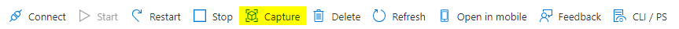

# Building apps for FoodPort

To build applications for [FoodPort](http://10.148.57.4/), you must have access to the Microsoft Azure [FoodPort Portal](https://portal.azure.com/#home) and have the necessary permissions for creating a new **virtual machine (VM)** image.
Contact Adam Koziol ([adam.koziol@inspection.gc.ca](mailto:adam.koziol@inspection.gc.ca)) to obtain these necessary permissions.

## How apps work on FoodPort

When a user runs a command on FoodPort (e.g. assembling a bacterial genome), a batch VM is created based upon a pre-existing VM image which contains the necessary software and dependencies for executing this command.
If there are any files that are needed as input for the software inside of the batch VM (e.g. `.fastq.gz`), these are placed inside of a blob container and mounted to the batch VM using [BlobFuse](https://learn.microsoft.com/en-us/azure/storage/blobs/blobfuse2-what-is).
Once mounted, these files are available to be used by the batch VM for processing, analysis, etc.
Finally, a Shell command is executed within the batch VM to perform the desired task.
All of this happens beneath the FoodPort web interface.

Therefore, the requirements for building an application on FoodPort are:

- A VM image containing the necessary software and dependencies for executing the desired command(s).
- A web user interface for users to submit their command(s).

## Developing in VMs

To add software and other dependencies to your new VM image, the process is as follows:

1. Spin up/start a new VM.
2. Connect to the new VM.
3. Install software and other dependencies.
4. Capture the VM as a VM image version.

### Spinning up a new VM

To spin up/start a new VM:

1. In the Microsoft Azure [FoodPort Portal](https://portal.azure.com/#home), navigate to [Virtual machines](https://portal.azure.com/#view/HubsExtension/BrowseResource/resourceType/Microsoft.Compute%2FVirtualMachines).

2. In the top-left corner of the window, click 'Create' and choose 'Azure virtual machine'.
   
3. Under the Basics tab, change the following:

      - Subscription: `CFDC-FoodPort-Sub`
      - Resource group: `CFDC-FoodPort-Batch-rg`
      - Virtual machine name: `name_of_new_image`
      - Region: `(Canada) Canada Central`
      - Image: `Ubuntu Server 20.04 LTS - x64 Gen2`
      - Security type: `Standard`
        - (The image must be selected first)
      - Size: `Standard_D4ds_v5`
      - Authentication type: Password
        - Username: `[username]`
        - Password: `password`
      - Public inbound ports: `None`

4. Under the Networking tab, change the following:

      - Virtual network: `CFDC-FoodPort-vnet`
      - Subnet: `CFDC-FoodPort-BatchNodes-snet (10.148.57.32/27)`
      - Public IP: `None`

5. Under the Tags tab, change the following:

      - Name: `TechContact`
      - Value: `email_address_of_contact`

6. Under the Review + create tab, click 'Create' and wait for the VM image to be created.

### Connecting to a new VM

If you followed the previous steps, you can click on 'Go to resource' after the VM has started, then:

1. In the top-left corner of the window, click 'Connect'.
2. A new page will appear. Under the SSH tab, within Step 4, copy the Shell command that will be used to connect to the running VM.
      - e.g. `ssh -i <private key path> username@ip_address`
3. Run this command in a UNIX terminal on a machine that's connected to the CFIA network, but omit the `-i <private key path>` part.
      - i.e. `ssh username@ip_address`

### Installing software and other dependencies in a new VM

!!! warning

    If you connect to the VM within your terminal and then disconnect, the VM will stop, and all changes that you've made to the VM will be lost.
    Before disconnecting from the VM, remember to [capture the VM](#capturing-a-new-vm-as-a-vm-image-version) first to **save your changes**.

Software and other dependencies can be installed in the new VM using normal installation commands (e.g. `sudo apt install`).
When using commands that require SSL certificate verification by default (e.g. `wget`), you may receive an error because of the CFIA firewall.
If you require assistance with this, please contact Adam Koziol ([adam.koziol@inspection.gc.ca](mailto:adam.koziol@inspection.gc.ca)).

### Capturing a new VM as a VM image version

A running VM can be **captured** as a new VM image version, which allows the user to save changes that are made to the software environment within the VM for future use after the running VM is shut down.

To capture a running VM as a VM image version:

1. Navigate to [Virtual machines](https://portal.azure.com/#view/HubsExtension/BrowseResource/resourceType/Microsoft.Compute%2FVirtualMachines), click on the running virtual machine, and go to the 'Overview' section.
   
2. At the top of the window, click 'Capture'.

    

3. Choose the following:

      - Subscription: `CFDC-FoodPort-Batch-rg`
      - Share image to Azure compute gallery: 'Yes, share it to a gallery as a VM image version'
      - (Optional) Check 'Automatically delete this virtual machine after creating the image'
      - Target Azure compute gallery: `[Gallery where the VM image is located]`
      - Operating system state: `Generalized`
      - Target VM image definition: `[VM image name]`
      - Version number: `[VM image version number]`
        - e.g. `0.0.2`

4. Under the Review + create tab, click 'Create' and wait for the VM to be captured as a new VM image version (could take a few minutes).

## Creating a user interface
