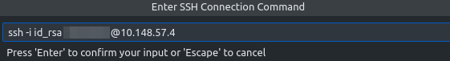

# Connecting to FoodPort

To develop applications for [FoodPort](http://10.148.57.4/), you need to be able to connect to the CFIA network **and** have a way of SSHing into FoodPort using an SSH client (e.g. [PuTTY](https://putty.org/) or [Visual Studio Code](https://code.visualstudio.com/) with an [SSH extension](https://code.visualstudio.com/docs/remote/ssh)).

You'll also need a username and an RSA private key file which can be obtained by contacting Adam Koziol ([adam.koziol@inspection.gc.ca](mailto:adam.koziol@inspection.gc.ca)).

## Using a terminal

With a private key file `id_rsa`:

```bash
ssh -i id_rsa [username]@10.148.57.4
```

## Using VS Code's Remote - SSH extension

1. Install and enable VS Code's [Remote - SSH extension](https://code.visualstudio.com/docs/remote/ssh).

2. Click on the Remote Explorer icon in the toolbar on the left side of your VS Code window.

    { width="35" }

3. Add a new remote connection.

    

4. Enter the SSH connection command (e.g. `ssh -i id_rsa [username]@10.148.57.4`), remembering to specify the absolute path to `id_rsa` on your system.

    

5. Choose the SSH configuration file to update on your system.

    